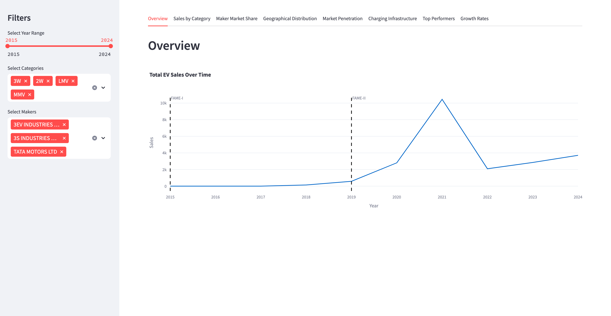
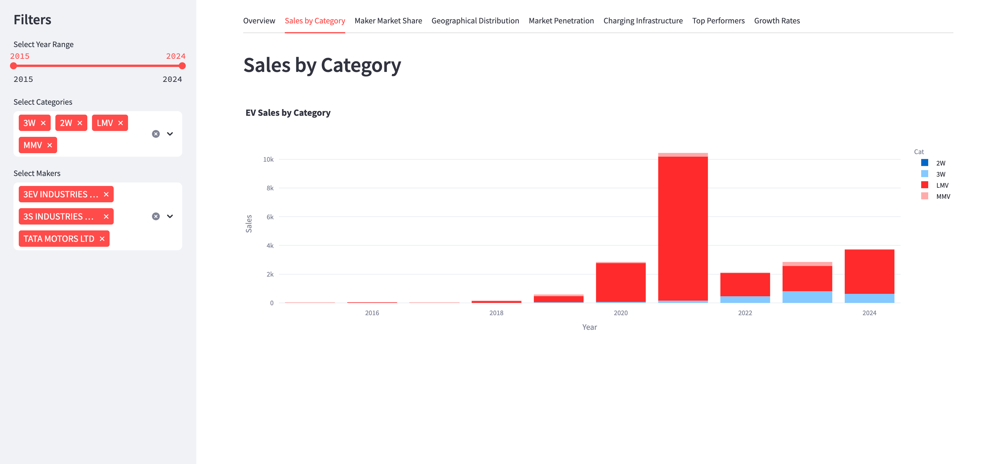
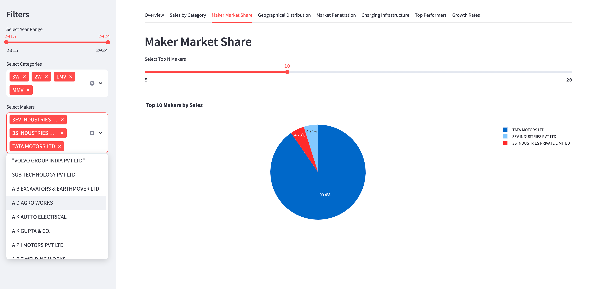
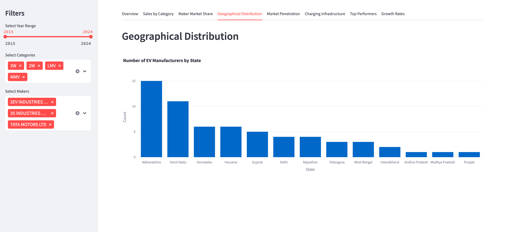
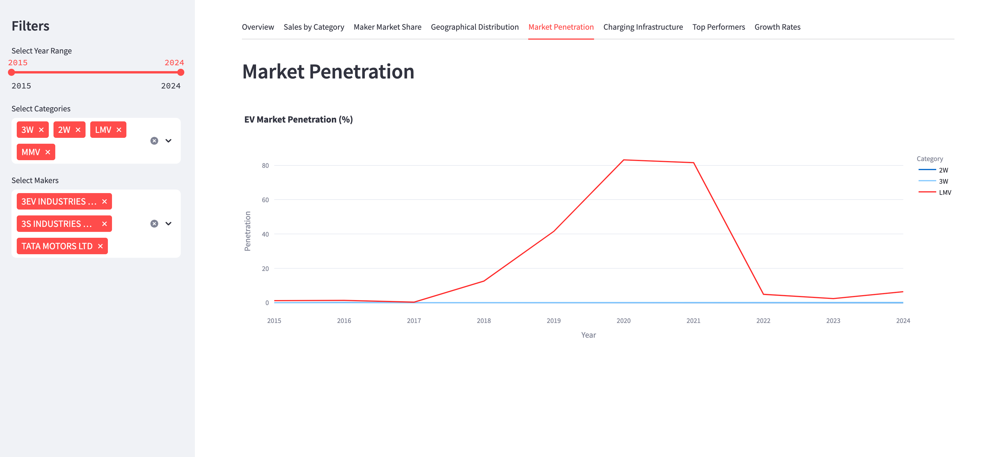
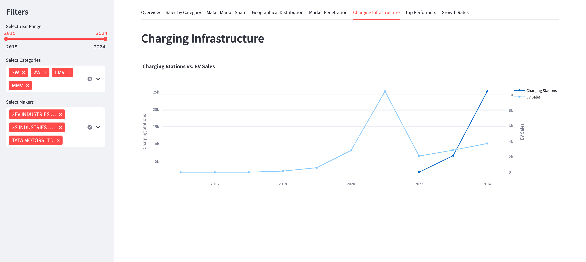
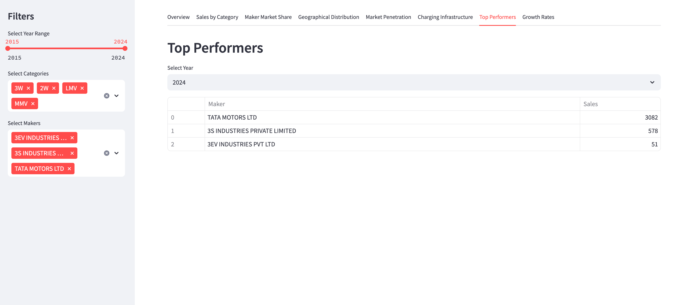
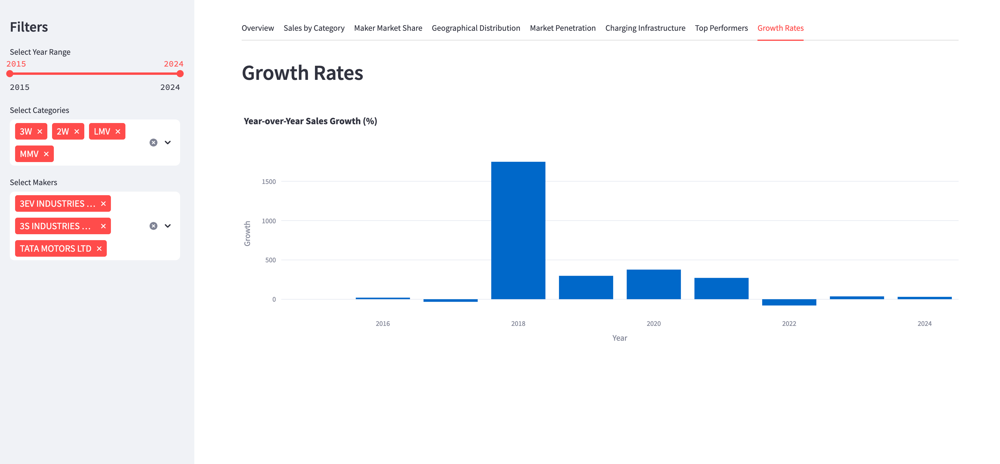

# India EV Market Dashboard

This project provides an interactive dashboard to analyze the electric vehicle (EV) market in India from 2001 to 2024. Using data from [Kaggle](https://www.kaggle.com/datasets/srinrealyf/india-ev-market-data), the dashboard offers insights into EV sales trends, market shares of manufacturers, geographical distribution of EV makers, and market penetration of EVs compared to total vehicle registrations. Built with Streamlit, it enables users to explore data through interactive visualizations and filters.

## Dataset

The project uses the following datasets from the [Kaggle India EV Market Data](https://www.kaggle.com/datasets/srinrealyf/india-ev-market-data):

| File Name                          | Description                                                                 | Usage in Dashboard                     |
|------------------------------------|-----------------------------------------------------------------------------|----------------------------------------|
| `ev_sales_by_makers_and_cat_15-24.csv` | EV sales by manufacturers and vehicle categories (e.g., 2W, 3W) from 2015-2024 | Sales trends, market share, category analysis |
| `ev_cat_01-24.csv`                 | Vehicle registration data by category (e.g., two-wheelers, three-wheelers) from 2001-2024 | Market penetration calculations        |
| `EV Maker by Place.csv`            | List of EV manufacturers and their locations (city, state) in India         | Geographical distribution of makers     |

**Note**: Other files in the dataset (e.g., `OperationalPC.csv`, `Vehicle Class - All.csv`) are not used in this project.

## Installation

To run the dashboard locally, follow these steps:

1. **Clone the repository**:
   ```bash
   git clone https://github.com/yourusername/india-ev-market-dashboard.git
   cd india-ev-market-dashboard
   ```

2. **Create a virtual environment** (recommended):
   ```bash
   python -m venv venv
   source venv/bin/activate  # On Windows: venv\Scripts\activate
   ```

3. **Install dependencies**:
   ```bash
   pip install -r requirements.txt
   ```
   The `requirements.txt` includes:
   ```
   streamlit~=1.45.0
   pandas~=2.2.3
   plotly~=6.0.1
   geopandas
   watchdog
   numpy~=2.2.5
   seaborn
   matplotlib
   ```

## Usage

To launch the dashboard:

1. Ensure the dataset files (`ev_sales_by_makers_and_cat_15-24.csv`, `ev_cat_01-24.csv`, `EV Maker by Place.csv`) are in the project directory.
2. Run the Streamlit app:
   ```bash
   streamlit run streamlit_app.py
   ```
3. Open a web browser and navigate to `http://localhost:8501` to view the dashboard.

## Features

The dashboard offers eight interactive tabs, each providing unique insights into the India EV market:

| Tab Name                  | Description                                                                 | Visualization Type         |
|---------------------------|-----------------------------------------------------------------------------|----------------------------|
| **Overview**              | Tracks total EV sales trends (2015-2024) with policy markers (FAME-I, FAME-II) | Line chart                |
| **Sales by Category**     | Displays sales by vehicle categories (e.g., 2W, 3W, LMV)                    | Bar chart                 |
| **Maker Market Share**    | Shows market share of top N manufacturers                                  | Pie chart                 |
| **Geographical Distribution** | Visualizes EV manufacturer locations by state                            | Bar chart                 |
| **Market Penetration**    | Analyzes EV share in total vehicle registrations by category                | Line chart                |
| **Charging Infrastructure** | Compares charging station growth with EV sales (2022-2024)                | Dual-axis scatter plot    |
| **Top Performers**        | Lists top 5 manufacturers by sales in a selected year                      | Table                     |
| **Growth Rates**          | Examines year-over-year EV sales growth                                    | Bar chart                 |

**Interactive Filters**:
- **Year Range**: Select a range between 2015 and 2024.
- **Categories**: Filter by vehicle types (e.g., 2W, 3W).
- **Makers**: Choose specific manufacturers to analyze.

**Note**: Charging station data is manually entered and may not reflect the latest figures.

## Screenshots

#### Overview


#### Sales by Category 


#### Maker Market Share


#### Geographical Distribution


#### Market Penetration


#### Charging Infrastructure


#### Top Performers


#### Growth Rates



## Deployment

The dashboard is deployed on Streamlit Cloud and can be accessed at [India EV Market Dashboard](https://indiaevmarketdashboard-supratim-sircar.streamlit.app/).

## Video Presentation Link
[Demo video](https://drive.google.com/file/d/1ReVKX9ESKuPSWDTsWR5_whshzaH0w2v_/view?usp=sharing)

## Technologies Used

- [Streamlit](https://streamlit.io/): Interactive web application framework.
- [Pandas](https://pandas.pydata.org/): Data manipulation and analysis.
- [Plotly](https://plotly.com/): Interactive visualizations.

## Acknowledgements

- Data sourced from [Kaggle: Detailed India EV Market Data 2001 - 2024](https://www.kaggle.com/datasets/srinrealyf/india-ev-market-data).
- Thanks to the dataset provider for making this data publicly available.

## Glossary

- **Streamlit**: A Python library for creating interactive web applications.
- **Market Penetration**: The percentage of EVs in total vehicle registrations.
- **FAME-I/FAME-II**: Government policies promoting EV adoption in India.
